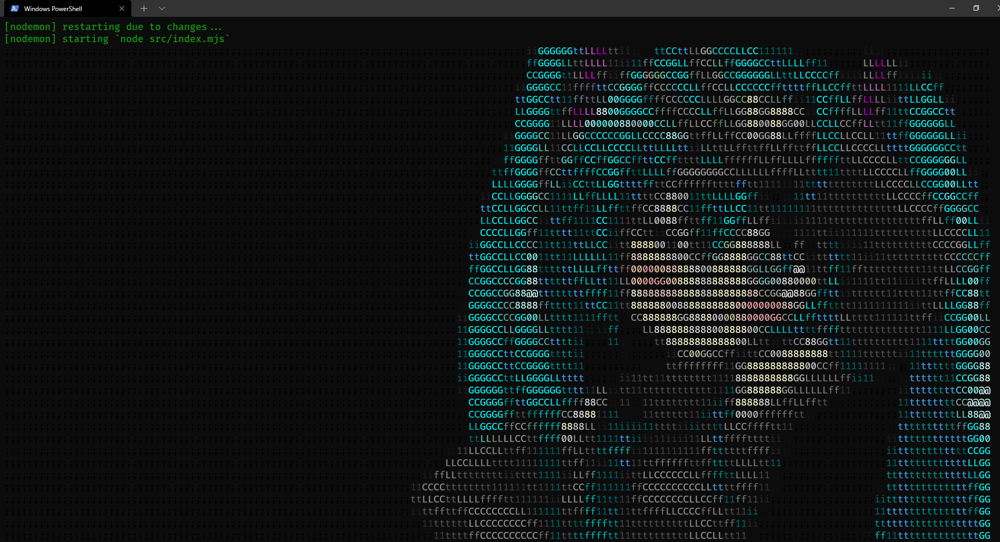

#SCREENSHOTS...

How to run this small application in your environment?

You must have nodeJS installed...

After that you need to run `yarn` to install the dependencies...

then run `yarn dev`

Have fun
